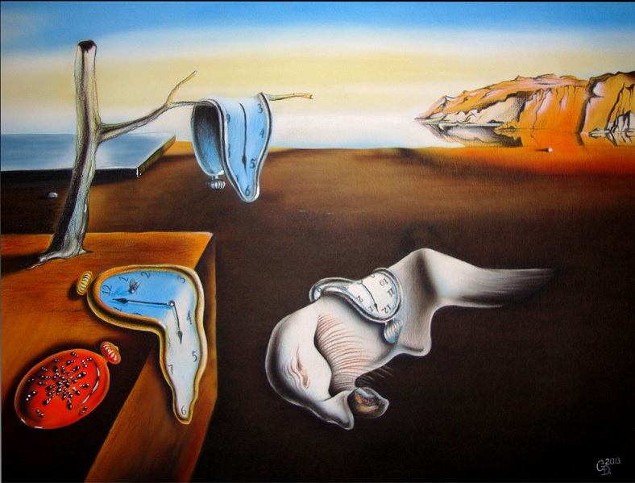
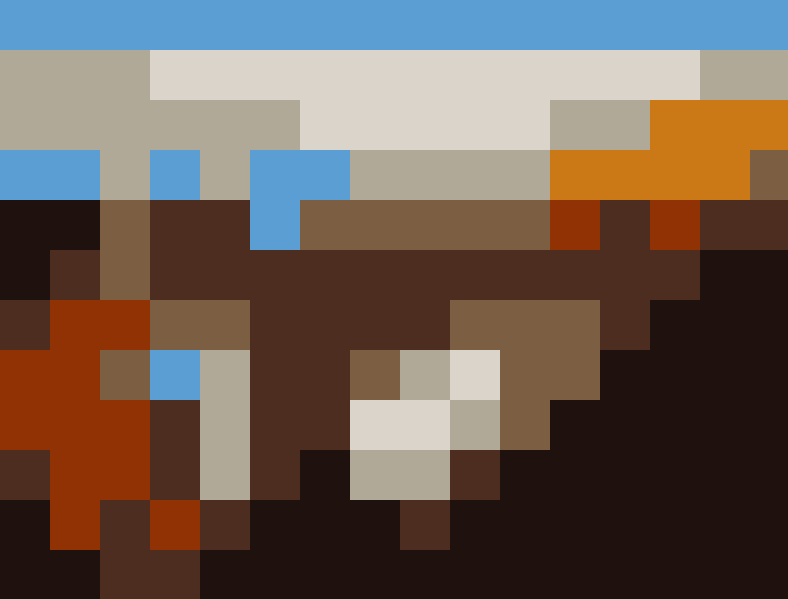
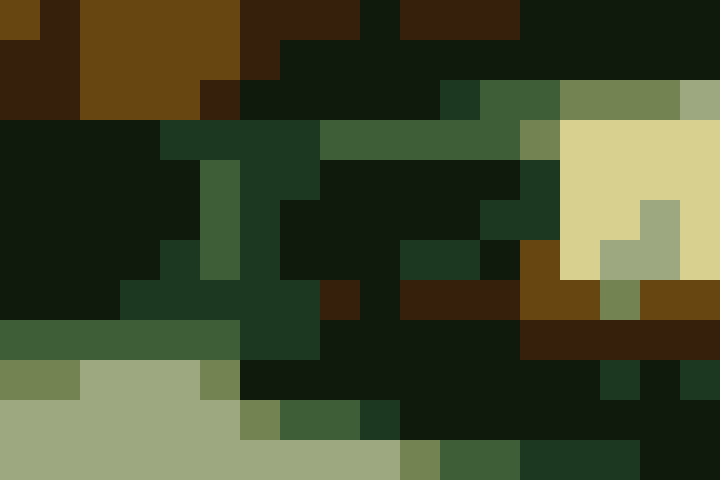
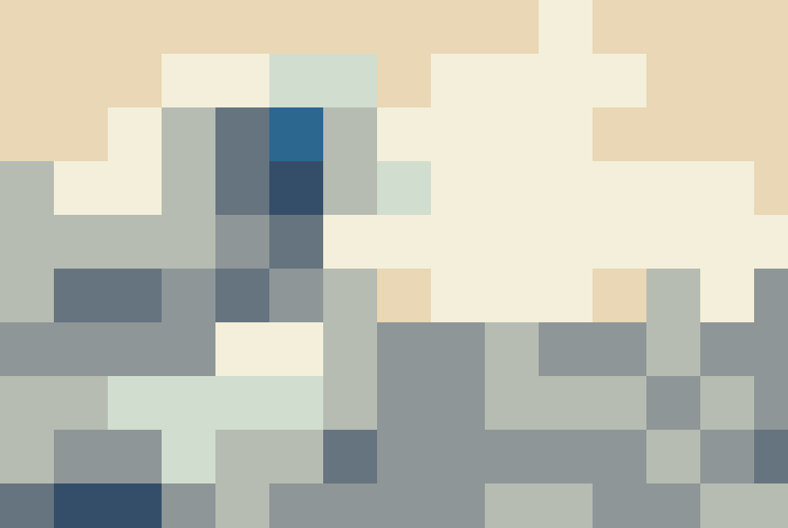
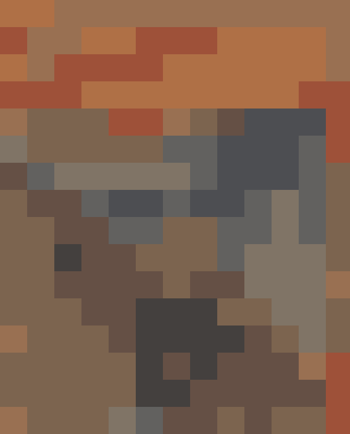
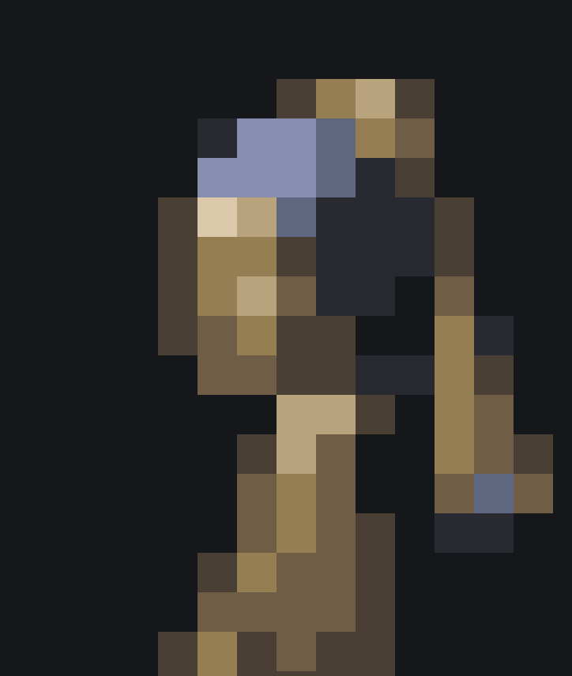
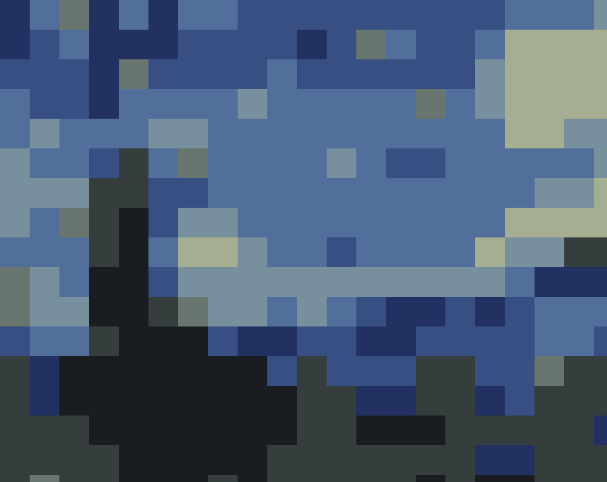
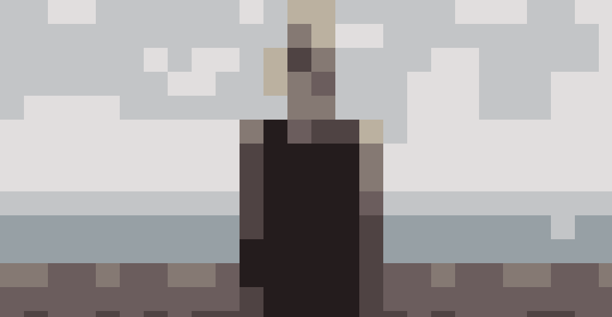

# distill

`distill` is a small go program which takes an image and redraws a primitive version using only extremely simplified shape and colour information. It's designed to be run against works of art, but any input image can be used.

<p align="center">
  
  <span/>
  
</p>

While the output is basic, `distill` tries to generate recognisable images which retain the character and substance of the original. Whether it succeeds at this or not is up to you.

## Running
Download a binary release (todo) or fetch the package
```
go get github.com/jamesbarnett91/distill
```
Then invoke `distill` passing an image e.g. `distill some-magnum-opus.png`

`distill` takes the follwing optoins which can be used to adjust the output:
```
Usage:
  distill [OPTIONS] [file]

Application Options:
  -b, --block-size=           The size of the blocks the image should be distilled to. E.g. 10 will result in square blocks of 10x10 pixels. Note
                              that this is the size of the blocks, not the number of blocks. (default: 50)
  -n, --max-dominant-colours= The number of dominant colours to be extracted from the image. (default: 8)
  -o, --output-path=          Path to the output file. The format will be png. (default: out.png)

Help Options:
  -h, --help                  Show this help message

```


## Procedure
The distillation process has 4 steps. 
#### 1. Extract dominant colours
The n most dominant colours are extracted from the image. This is done via a [k-means clustering](https://en.wikipedia.org/wiki/K-means_clustering). 
#### 2. Divide into blocks
The image is divided into square blocks of size b. This has the effect of drastically 'enlarging' the pixels.
#### 3. Average the colour in each block
The average colour of each block is calculated. This creates an extremely low resolution version of the original (while preserving the size)
#### 4. Set each block to the closest dominant colour
The average colour of each block is compared to the previously extracted dominant colours. The block colour is set the the closest dominant colour based on its [euclidean distance](https://en.wikipedia.org/wiki/Euclidean_distance) in the [Lab](https://en.wikipedia.org/wiki/CIELAB_color_space) colour space.

## Samples

<p align="center">
  
  <span/>
  
</p>

<p align="center">
  
  <span/>
  
</p>

<p align="center">
  
  <span/>
  
</p>
